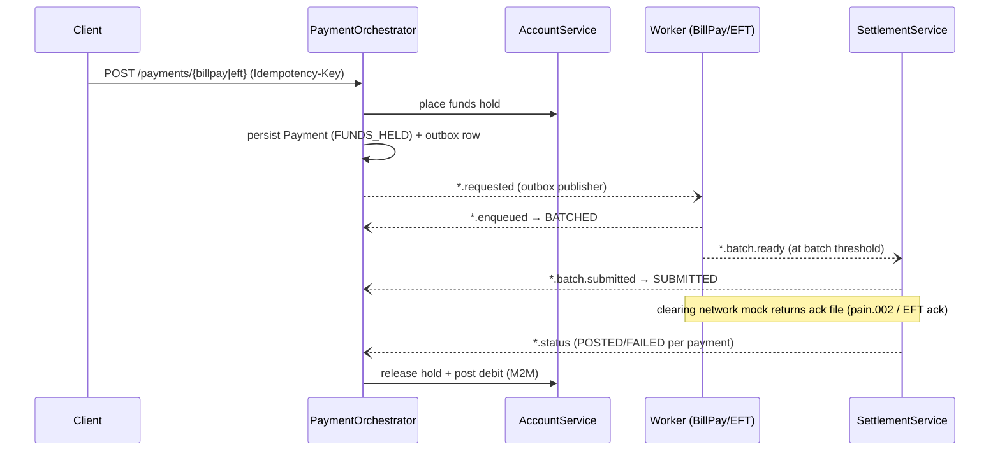

# Banking Platform — Event-Driven Payments over Spring Boot & Kafka

A distributed digital-banking backend of **9 Spring Boot microservices** implementing accounts, customers, and **two payment rails — Bill Pay and EFT** — with ledger-backed balances, funds holds, transactional-outbox event publishing, batch settlement, and mock clearing-network exchanges (pain.001/pain.002, CPA-005 style).

**Stack:** Java 17 · Spring Boot 3 · Spring Security (OAuth2 Resource Server / Auth0) · Spring Data JPA · PostgreSQL · Apache Kafka (KRaft) · OpenFeign · Maven

---

## Architecture

| Service | Port | Database | Responsibility |
|---|---|---|---|
| **AccountService** | 8084 | accountsdb | Ledger: accounts, balances, funds **holds**, credit/debit postings, transaction history. ETag/If-Match optimistic locking. |
| **CustomerService** | 8083 | customerdb | Customer master data, KYC state machine, idempotent creation via request fingerprints. |
| **AuthUser** | 8094 | — | Identity admin: provisions Auth0 users via the Management API (M2M). |
| **BillerService** | 8088 | billerdb | Biller registry; orchestrator validates billers against it. |
| **PaymentOrchestrator** | 8086 | paymentdb | Payment lifecycle for both rails: validate → hold funds → **transactional outbox** → drive state machine from Kafka events → post/release on settlement result. |
| **BillPayWorkerService** | 8090 | billpayworkerdb | Consumes bill-pay requests, files them into batches, emits batch-ready events; hosts the Central1 (pain.002) clearing mock. |
| **SettlementService** | 8080 | settlementdb | Consumes ready batches, builds clearing files, emits submitted/status events; retry + DLQ handling (bill-pay rail). |
| **EFTService** | 8089 | eftdb | External-account registry for the EFT rail (register → verify → active). |
| **EFTWorkerService** | 8091 | eftworkerdb | EFT batching worker; hosts the EFT network ack mock. |

Shared libraries: `commons-dto` (DTOs, shared Kafka event records, global exception handling), `commons-security` (OAuth2 resource-server config, JWT→authority converter, Feign token relay), `commons-observability` (correlation-ID filter + access logging).

## Payment flow (both rails follow the same choreography)



Payment state machine: `FUNDS_HELD → BATCHED → SUBMITTED → POSTED | FAILED` (failure compensates by releasing the hold).

## Kafka topics

| Bill Pay rail | EFT rail | Purpose |
|---|---|---|
| `billpay.requested` | `eft.requested` | Orchestrator → worker (via outbox) |
| `billpay.enqueued` | `eft.enqueued` | Worker → orchestrator (payment batched) |
| `bill.batch.ready` | `eft.batch.ready` | Worker → settlement |
| `bill.batch.submitted` | `eft.batch.submitted` | Settlement → orchestrator |
| `billpay.status` | `eft.status` | Settlement → orchestrator (per-payment result) |
| `central1.pain002` | `eftnetwork.ack` | Clearing-network mock → settlement |
| `bill.batch.retry` / `bill.batch.dlq` | *(planned)* | Settlement retry loop and dead-letter parking |

## Reliability patterns

- **Transactional outbox** — payment intent and its event are committed in one DB transaction; a scheduled publisher relays to Kafka, so accepted payments survive broker outages.
- **Idempotency everywhere** — client `Idempotency-Key` headers (unique-constrained), request fingerprinting on customer creation, and a `processed_event` table making every Kafka consumer idempotent: exactly-once *effects* on at-least-once delivery.
- **Optimistic concurrency** — version columns surfaced as ETags; writes accept `If-Match`.
- **Funds-hold saga** — money is held before anything is queued; the terminal event either captures (debit + release) or compensates (release only).
- **Zero-trust security** — every service independently validates Auth0 JWTs (issuer + audience + signature) and enforces scopes via `@PreAuthorize`; service-to-service calls use client-credentials M2M or token relay. A `dev` profile swaps in a permit-all chain for local development.

## Running locally

Prerequisites: JDK 17, Maven, PostgreSQL 16 (`localhost:5432`), Kafka 4.x in KRaft mode (`localhost:9092`).

```sql
-- one-time database setup
CREATE DATABASE accountsdb;    CREATE DATABASE customerdb;   CREATE DATABASE billerdb;
CREATE DATABASE paymentdb;     CREATE DATABASE billpayworkerdb;
CREATE DATABASE settlementdb;
CREATE ROLE eft LOGIN PASSWORD 'eft';             CREATE DATABASE eftdb OWNER eft;
CREATE ROLE eftworker LOGIN PASSWORD 'eftworker'; CREATE DATABASE eftworkerdb OWNER eftworker;
```

```bash
# build shared libraries first
mvn -q install -DskipTests -f commons-dto/pom.xml
mvn -q install -DskipTests -f commons-security/pom.xml
mvn -q install -DskipTests -f commons-observability/pom.xml

# then start each service (own terminal each) with the dev profile
mvn spring-boot:run -Dspring-boot.run.profiles=dev
```

Suggested start order: SettlementService → AccountService, BillerService, EFTService → workers → PaymentOrchestrator → CustomerService/AuthUser.

### Try an end-to-end bill payment

```bash
# 1. create an account (note the returned id)
curl -X POST localhost:8084/api/v1/accounts -H "Content-Type: application/json" \
  -H "Idempotency-Key: demo-1" \
  -d '{"customerId":"cust-001","accountType":"CHEQUING","accountSubType":"PERSONAL","status":"ACTIVE","currency":"CAD","openingBalance":1000.00}'

# 2. submit a bill payment (biller must exist in billerdb)
curl -X POST localhost:8086/api/v1/payments/billpay -H "Content-Type: application/json" \
  -H "Idempotency-Key: pay-1" \
  -d '{"debtorAccountId":"<accountId>","billerReferenceNumber":"HYDRO-001","invoiceReference":"INV-1","executionDate":"2026-12-01","amount":{"value":100.00,"currency":"CAD"}}'

# 3. simulate the clearing-network response for the batch (batchId from worker logs)
curl -X POST localhost:8090/api/mock/central1/pain002/<batchId>

# 4. watch the payment reach POSTED and the ledger balance drop
curl localhost:8086/api/v1/payments/<paymentId>
curl localhost:8084/api/v1/accounts/<accountId>/balance
```

The EFT rail works the same way: register + verify an external account on `:8089`, `POST /api/v1/payments/eft` on `:8086`, then ack via `POST :8091/api/mock/eftnetwork/ack/{batchId}`.

## Roadmap

- Retry/DLQ path for the EFT rail (mirroring bill-pay)
- Consent service for FDX-style data-sharing scopes
- Contract tests for the Kafka event schemas
