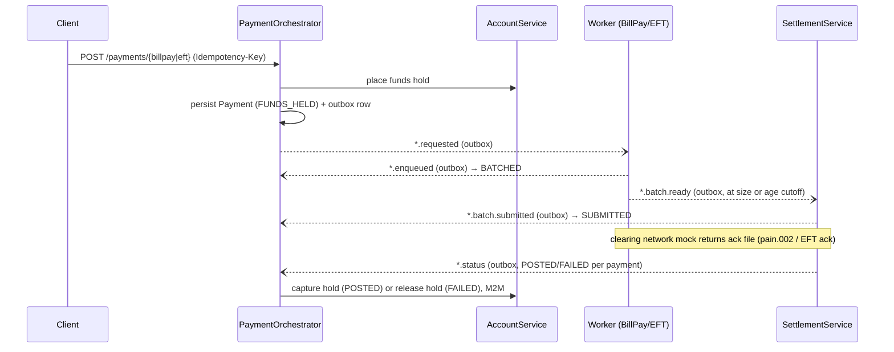

# Banking Platform — Event-Driven Payments over Spring Boot & Kafka

A distributed digital-banking backend of **9 Spring Boot microservices** implementing accounts, customers, and **two payment rails — Bill Pay and EFT** — with ledger-backed balances, funds holds, transactional-outbox event publishing, batch settlement, and mock clearing-network exchanges (pain.001/pain.002, CPA-005 style).

**Stack:** Java 17 · Spring Boot 3 · Spring Security (OAuth2 Resource Server / Auth0) · Spring Data JPA · PostgreSQL · Apache Kafka (KRaft) · OpenFeign · Maven

---

## Architecture

| Service | Port | Database | Responsibility |
|---|---|---|---|
| **AccountService** | 8084 | accountsdb | Ledger: accounts, balances, funds **holds** (place / capture / release), credit/debit postings, transaction history. Row locks on every balance change; ETag/If-Match optimistic locking. |
| **CustomerService** | 8083 | customerdb | Customer master data, KYC state machine, idempotent creation via request fingerprints. |
| **AuthUser** | 8094 | — | Identity admin: provisions Auth0 users via the Management API (M2M). |
| **BillerService** | 8088 | billerdb | Biller registry; orchestrator validates billers against it. |
| **PaymentOrchestrator** | 8086 | paymentdb | Payment lifecycle for both rails: validate → hold funds → **transactional outbox** → drive state machine from Kafka events → capture/release the hold on settlement result; fails dead-lettered batches. |
| **BillPayWorkerService** | 8090 | billpayworkerdb | Consumes bill-pay requests, files them into batches, closes batches on a size **or** age cutoff; hosts the Central1 (pain.002) clearing mock. |
| **SettlementService** | 8080 | settlementdb | Consumes ready batches, builds clearing files, emits submitted/status events; DB-backed retry with exponential backoff, then DLQ (both rails). |
| **EFTService** | 8089 | eftdb | External-account registry for the EFT rail (register → verify → active). |
| **EFTWorkerService** | 8091 | eftworkerdb | EFT batching worker (same cutoff rules); hosts the EFT network ack mock. |

Shared libraries: `commons-dto` (DTOs, shared Kafka event records, global exception handling), `commons-security` (OAuth2 resource-server config, JWT→authority converter, Feign token relay), `commons-observability` (correlation-ID filter + access logging).

## Payment flow (both rails follow the same choreography)



Payment state machine: `FUNDS_HELD → BATCHED → SUBMITTED → POSTED | FAILED`. Transitions only move forward, so a late or duplicate event can't send a payment back to an earlier state. A failure compensates by releasing the hold. If settlement can't upload a batch after all retries, the batch is dead-lettered and every payment in it is failed and its hold released.

## Kafka topics

| Bill Pay rail | EFT rail | Purpose |
|---|---|---|
| `billpay.requested` | `eft.requested` | Orchestrator → worker |
| `billpay.enqueued` | `eft.enqueued` | Worker → orchestrator (payment batched) |
| `bill.batch.ready` | `eft.batch.ready` | Worker → settlement (batch closed) |
| `bill.batch.submitted` | `eft.batch.submitted` | Settlement → orchestrator |
| `billpay.status` | `eft.status` | Settlement → orchestrator (per-payment result) |
| `bill.batch.dlq` | `eft.batch.dlq` | Settlement → orchestrator (retries exhausted) |
| `central1.pain002` | `eftnetwork.ack` | Clearing-network mock → settlement |

Topic names live in one place, `commons-dto/.../events/Topics.java`, which both producers and consumers use.

## Reliability patterns

- **Transactional outbox in every service that emits events.** The orchestrator, both workers and settlement write each event in the same DB transaction as the state change that caused it. A scheduled publisher relays them to Kafka (`FOR UPDATE SKIP LOCKED`, so running several instances is safe). A failed send stays pending and is retried in order, so events are never lost or published for a rolled-back change.
- **Idempotent consumers everywhere.** The orchestrator dedupes on a `processed_events` table. The workers skip payments that are already batched (unique `payment_id`). Settlement ignores duplicate `batch.ready` events, and it derives status event ids from the payment id, so a redelivered clearing file produces the same ids and is dropped downstream. The result is exactly-once *effects* on at-least-once delivery.
- **No overdrafts under concurrency.** Every balance or hold change in AccountService takes a row lock on the account (`SELECT … FOR UPDATE`), so parallel debits and holds on one account are serialized and can't both pass the available-funds check.
- **Atomic settlement.** `POST /accounts/{id}/holds/{holdId}/capture` turns the hold into a debit in one transaction and is idempotent. There's no window where the money is neither held nor debited.
- **Retry with backoff, then dead-letter.** A failed batch upload is retried from the database (5s, 10s, 20s by default), so retries survive restarts. After that the batch is `DEAD_LETTERED` and the orchestrator compensates.
- **Batching on a real cutoff.** A batch closes at `batching.max-size` payments or after `batching.max-age`, whichever comes first. The listener and the cutoff job both lock the open batch row, so a payment can't slip into a batch that's being closed.
- **Optimistic concurrency.** Version columns are surfaced as ETags, and writes accept `If-Match`.
- **Zero-trust security.** Every service independently validates Auth0 JWTs (issuer, audience and signature) and enforces scopes via `@PreAuthorize`. Service-to-service calls use client-credentials M2M or token relay. The `dev` profile swaps in a permit-all chain for local development.
- **Schema migrations.** Each service owns its schema through Flyway (`src/main/resources/db/migration`), and Hibernate only validates it (`ddl-auto: validate`).

## Running locally

### With Docker (recommended)

You need Docker Desktop and nothing else: no JDK, Maven, Postgres or Kafka.

```bash
docker compose up -d --build     # first build takes a while; later ones are cached
docker compose ps                # everything "running"; kafka-init "exited (0)"
docker compose logs -f payment-orchestrator
docker compose down              # stop (add -v to also wipe the databases)
```

All services run with the `dev` profile, so no Auth0 is needed. Ports are the ones in the table above, plus Postgres on `localhost:5433` (user and password `postgres`) and Kafka on `localhost:9092`.

On a machine with 8 GB of RAM, build one service at a time (`docker compose build account-service`, and so on) instead of all at once, and close memory-heavy apps first.

### Without Docker

Prerequisites: JDK 17, Maven, PostgreSQL 16 (`localhost:5432`), Kafka 4.x in KRaft mode (`localhost:9092`). Create the databases with [`docker/postgres/init.sql`](docker/postgres/init.sql), then:

```bash
# build shared libraries first
mvn -q install -DskipTests -f commons-dto/pom.xml
mvn -q install -DskipTests -f commons-security/pom.xml
mvn -q install -DskipTests -f commons-observability/pom.xml

# then start each service (own terminal each) with the dev profile
mvn spring-boot:run -Dspring-boot.run.profiles=dev
```

Flyway creates the tables on first start. A database that was previously created by Hibernate (`ddl-auto: update`) needs to be dropped and recreated first.

Credentials for non-dev profiles come from environment variables. See [`.env.example`](.env.example).

### Try an end-to-end bill payment

```bash
# 1. create an account (note the returned id)
curl -X POST localhost:8084/api/v1/accounts -H "Content-Type: application/json" \
  -H "Idempotency-Key: demo-1" \
  -d '{"customerId":"cust-001","accountType":"CHEQUING","accountSubType":"PERSONAL","status":"ACTIVE","currency":"CAD","openingBalance":1000.00}'

# 2. register a biller (creating billers needs a logged-in customer, so in dev insert it directly)
docker compose exec postgres psql -U postgres -d billerdb -c \
  "insert into billers (id, customer_id, name, reference_number, category, status, created_at, updated_at)
   values (gen_random_uuid(), 'cust-001', 'Hydro', 'HYDRO-001', 'Electricity', 'ACTIVE', now(), now());"

# 3. submit a bill payment
curl -X POST localhost:8086/api/v1/payments/billpay -H "Content-Type: application/json" \
  -H "Idempotency-Key: pay-1" \
  -d '{"debtorAccountId":"<accountId>","billerReferenceNumber":"HYDRO-001","invoiceReference":"INV-1","executionDate":"2026-12-01","amount":{"value":100.00,"currency":"CAD"}}'

# 4. within ~15s the batch closes and is submitted: state SUBMITTED, batchId set
curl localhost:8086/api/v1/payments/<paymentId>

# 5. simulate the clearing network's response for that batch
curl -X POST localhost:8090/api/mock/central1/pain002/<batchId>
#    ...or reject it:  ?rejectAll=true   /   ?reject=<paymentId>

# 6. the payment is POSTED and the ledger balance drops (FAILED + hold released if rejected)
curl localhost:8086/api/v1/payments/<paymentId>
curl localhost:8084/api/v1/accounts/<accountId>/balance
```

The EFT rail works the same way: register and verify an external account on `:8089`, `POST /api/v1/payments/eft` on `:8086`, then send the ack via `POST :8091/api/mock/eftnetwork/ack/{batchId}`.

**Watch retries and dead-lettering:** start settlement with uploads always failing, `CENTRAL1_FAILURE_RATE=1 docker compose up -d settlement-service`, then submit a payment. Settlement logs four failed attempts about 5s, 10s and 20s apart, dead-letters the batch, and the payment ends `FAILED` with its hold released.

## Roadmap

- Integration tests with Testcontainers (real Postgres and Kafka) covering duplicate delivery, crashes and concurrent debits
- Consent service for FDX-style data-sharing scopes
- Contract tests for the Kafka event schemas
